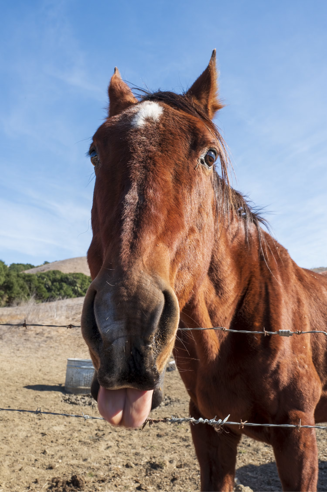

# Funcionamento da classe Cavalo()
Seguindo a ideia de abstração trabalhada nas aulas, a classe Cavalo() tem o objetivo de facilitar a criação de inúmeros objetos que possuem alguns atributos e métodos (funções) selecionados, que têm relação ao animal existente.

# Representação do objeto na vida real

 
<i>(literalmente)</i>

# Guia para utilização dos métodos
Procurei utilizar os métodos levantados na fase inicial de abstração do projeto. Porém, entendo que eles acabaram não combinando muito com o objetivo das atividades propostas na data de 19.08. Portanto, esta foi a melhor adaptação que consegui realizar para cumprir minimamente os pontos exigidos:
- **galopar()**: método void que verifica o atributo "cansado" e tem dois outputs possíveis:
  - caso seja <u>negativo</u>: printa uma linha no terminal simulando o galope do cavalo e altera o atributo "cansado" para true; 
  - caso seja <u>positivo</u>: printa uma linha no terminal indicando que o cavalo está cansado demais para galopar, mantendo  o atributo "cansado" inalterado.    
- **relinchar()**: método void que verifica o atributo "cansado" e tem dois outputs:
    - caso seja <u>negativo</u>: printa uma linha no terminal simulando o relinchar do cavalo, mantendo  o atributo "cansado" inalterado (visto que o cavalo já está descansado).
    - caso seja <u>positivo</u>: printa uma linha no terminal simulando o relinchar do cavalo descansando e altera o atributo "cansado" para false.